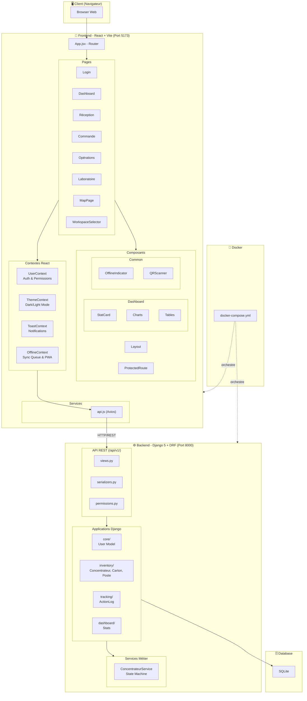

# Defi EDF - Concentrateur Tracker

Application web de gestion du cycle de vie des Concentrateurs CPL pour EDF SEI.

## 🚀 Démarrage rapide (Docker - Recommandé)

Le moyen le plus simple de lancer le projet est d'utiliser Docker Compose.

```bash
# Premier démarrage ou après modification des dépendances (requirements.txt / package.json)
docker-compose up --build

# Usage quotidien (plus rapide)
docker-compose up
```

L'application sera accessible sur :
- **Frontend** : http://localhost:5173
- **Backend API** : http://localhost:8000
- **Admin Django** : http://localhost:8000/admin

### Installation Manuelle (Alternative)

Si vous ne souhaitez pas utiliser Docker :

#### Prérequis

- Python 3.10+
- Node.js 18+
- npm

#### Installation

```bash
# 1. Backend (Django)
python3 -m venv venv
source venv/bin/activate
pip install -r requirements.txt
python manage.py migrate

# 2. Frontend (React/Vite)
cd frontend
npm install
```

#### Lancement (développement)

Lancer les deux serveurs en parallèle :

```bash
# Terminal 1 - Backend (port 8000)
source venv/bin/activate
python manage.py runserver

# Terminal 2 - Frontend (port 5173)
cd frontend
npm run dev
```

L'application sera accessible sur **http://localhost:5173**

## ⚙️ Configuration

1. Copier le fichier d'environnement (si non fait par Docker) :
```bash
cp .env.example .env
```

2. Modifier les variables dans `.env` selon votre configuration.

## 🧪 Tests

### Via Docker

Assurez-vous que l'application est lancée (`docker-compose up`).

Pour lancer la suite de tests unitaires dans le conteneur :

```bash
docker-compose exec backend pytest
```

### En local

```bash
source venv/bin/activate
pytest --ds=config.settings
```


## 📁 Structure du projet

```
Defi-EDF/
├── api/                     # API REST (Django REST Framework)
│   ├── serializers.py       # Sérialiseurs DRF
│   ├── views.py             # ViewSets et APIViews
│   ├── urls.py              # Routes API
│   └── permissions.py       # Permissions personnalisées
│
├── apps/                    # Applications Django
│   ├── core/                # Modèle User, authentification
│   ├── inventory/           # Modèles Concentrateur, Carton, Poste
│   ├── tracking/            # Historique des actions
│   └── dashboard/           # Statistiques
│
├── config/                  # Configuration Django
│   ├── settings.py          # Paramètres du projet
│   ├── urls.py              # Routes principales
│   └── wsgi.py              # Point d'entrée WSGI
│
├── services/                # Logique métier
│   └── business_logic.py    # ConcentrateurService (transitions d'état)
│
├── frontend/                # Application React (Vite)
│   ├── src/
│   │   ├── components/      # Composants réutilisables
│   │   │   ├── Layout.jsx       # Layout avec sidebar responsive
│   │   │   ├── ProtectedRoute.jsx # HOC de protection des routes
│   │   │   ├── Portal.jsx       # Portail React pour modales
│   │   │   ├── common/          # Composants utilitaires
│   │   │   │   ├── OfflineIndicator.jsx  # Indicateur mode hors-ligne
│   │   │   │   └── QRScanner.jsx         # Scanner QR Code
│   │   │   └── dashboard/       # Composants Dashboard
│   │   │       ├── StatCard.jsx          # Carte statistique
│   │   │       ├── InventoryCharts.jsx   # Graphiques stock
│   │   │       ├── InventoryTable.jsx    # Tableau inventaire
│   │   │       ├── PerformanceCharts.jsx # Graphiques performance
│   │   │       ├── ActivityFeed.jsx      # Flux d'activité
│   │   │       ├── CoverageMap.jsx       # Carte de couverture
│   │   │       ├── DashboardAlerts.jsx   # Alertes dashboard
│   │   │       └── DetailModal.jsx       # Modale détails
│   │   │
│   │   ├── context/         # Contextes React (gestion d'état global)
│   │   │   ├── UserContext.jsx    # Auth, permissions, profil utilisateur
│   │   │   ├── ThemeContext.jsx   # Thème clair/sombre
│   │   │   ├── ToastContext.jsx   # Notifications toast
│   │   │   └── OfflineContext.jsx # Mode hors-ligne, sync queue
│   │   │
│   │   ├── pages/           # Pages de l'application
│   │   │   ├── Login.jsx            # Authentification
│   │   │   ├── Dashboard.jsx        # Tableau de bord principal
│   │   │   ├── Reception.jsx        # Réception cartons (Magasin)
│   │   │   ├── Commande.jsx         # Commande cartons (BO)
│   │   │   ├── Operations.jsx       # Pose/Dépose (Terrain)
│   │   │   ├── Labo.jsx             # Tests concentrateurs (Labo)
│   │   │   ├── MapPage.jsx          # Carte géographique
│   │   │   └── WorkspaceSelector.jsx # Sélection espace de travail
│   │   │
│   │   ├── services/        # Client API
│   │   │   └── api.js       # Instance Axios configurée
│   │   │
│   │   ├── styles/          # Styles CSS
│   │   └── App.jsx          # Routeur principal (React Router)
│   │
│   ├── package.json
│   └── vite.config.js
│
├── docker-compose.yml       # Orchestration Docker
├── Dockerfile.backend       # Image Docker Backend
├── Dockerfile.frontend      # Image Docker Frontend
├── manage.py                # Script de gestion Django
├── requirements.txt         # Dépendances Python
└── README.md
```

## 🏗️ Architecture



### Contextes React (État Global)

| Contexte | Responsabilité |
|----------|----------------|
| **UserContext** | Authentification, profil utilisateur, vérification des permissions (`hasPermission`) |
| **ThemeContext** | Gestion du thème clair/sombre avec persistance LocalStorage |
| **ToastContext** | Système de notifications toast (success, error, info, warning) |
| **OfflineContext** | Mode hors-ligne PWA, file d'attente de synchronisation, détection réseau |

## 🔗 Endpoints API

| Endpoint | Description |
|----------|-------------|
| `POST /api/v1/auth/login/` | Authentification |
| `POST /api/v1/auth/logout/` | Déconnexion |
| `GET /api/v1/auth/me/` | Utilisateur courant |
| `GET /api/v1/concentrateurs/` | Liste des concentrateurs |
| `GET /api/v1/cartons/` | Liste des cartons |
| `GET /api/v1/postes/` | Liste des postes |
| `POST /api/v1/actions/reception/` | Réception carton (Magasin) |
| `POST /api/v1/actions/commande/` | Commande cartons (BO) |
| `POST /api/v1/actions/pose/` | Pose concentrateur (Terrain) |
| `POST /api/v1/actions/depose/` | Dépose concentrateur (Terrain) |
| `POST /api/v1/actions/test/` | Test concentrateur (Labo) |
| `GET /api/v1/dashboard/stats/` | Statistiques stock |

## 🛠️ Technologies

### Backend
- **Django 5.x** - Framework web Python
- **Django REST Framework** - API REST
- **SQLite** (dev)

### Frontend
- **React 18** - Framework UI
- **Vite** - Bundler et dev server
- **TailwindCSS** - Styling
- **Framer Motion** - Animations
- **Recharts** - Graphiques
- **Lucide React** - Icônes

## 👥 Rôles utilisateurs

| Rôle | Permissions |
|------|-------------|
| **Magasin** | Réception des cartons |
| **BO Commande** | Commande de cartons |
| **BO Terrain** | Pose/Dépose de concentrateurs |
| **Labo** | Tests des concentrateurs |

## 📄 Licence

Projet développé dans le cadre du Défi EDF.
